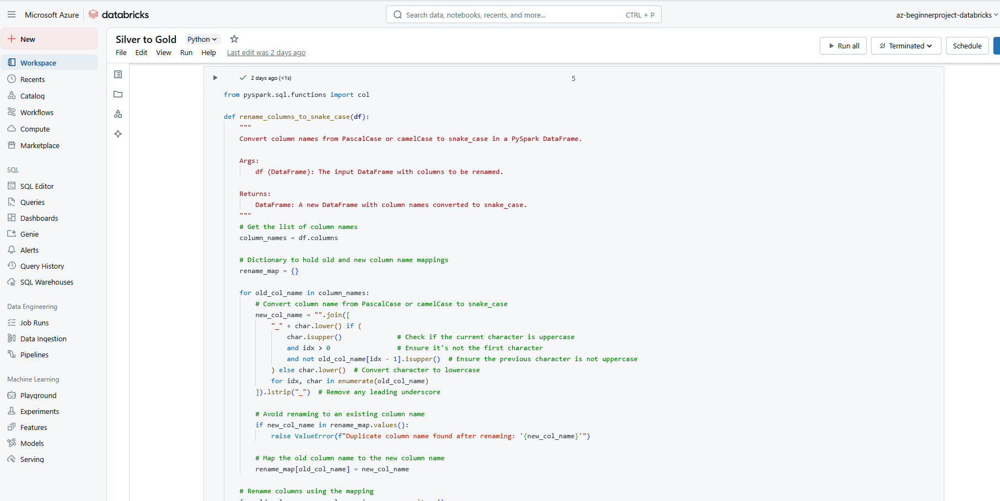
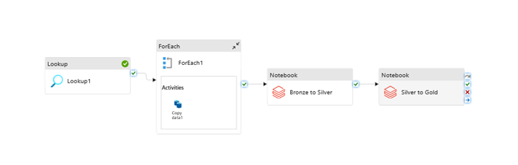
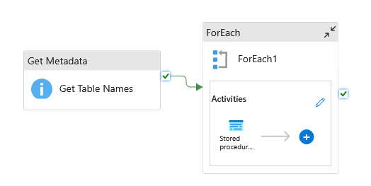
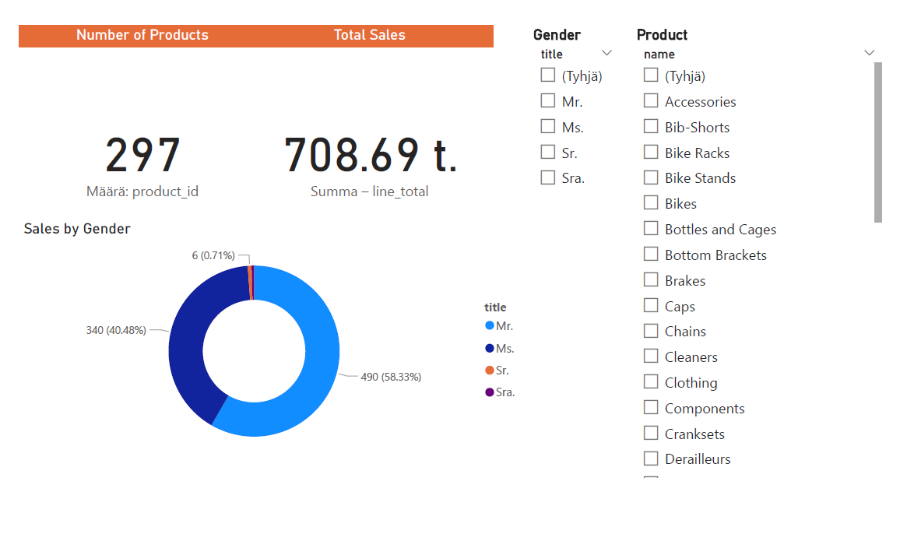

#  Azure End-to-End Data Engineering Pipeline (AdventureWorksLT2022)

This project is based on a tutorial by Luke J Byrne, which walks through building a complete Azure Data Engineering pipeline using the AdventureWorksLT2022 dataset.

I followed the tutorial closely, added my own documentation and structure, and completed the full pipeline using a free Azure account.

Link to original repo: https://github.com/lukejbyrne/rg-data-engineering-project/tree/main
Link to youtube step-by-step video: https://www.youtube.com/watch?v=ygJ11fzq_ik&t=7078s&ab_channel=LukeJByrne

## Why this project?

I chose this project to gain hands-on experience with real-world Azure tools and practices in a controlled setting. It simulates an end-to-end data pipeline for a fictional business using modern cloud data engineering technologies.

## Business requirements

The business has identified a gap in understanding customer demographics—specifically gender distribution—and how it influences product purchases. The key requirements include:

1. Sales by Gender and Product Category: A dashboard showing the total products sold, total sales revenue, and a gender split among customers.
2. Data Filtering: Ability to filter the data by product category, gender, and date.
3. User-Friendly Interface: Stakeholders should have access to an easy-to-use interface for making queries.

## Solution

**Tech Stack**: Azure Data Factory, Azure Data Lake Storage, Azure Databricks, Azure Synapse Analytics, Power BI, Azure Key Vault, SQL Server.

**Steps:**
- Load data to on-prem SQL
- Use Data Factory to copy data to Azure Data Lake Storage
- Transform and clean data using Azure Databricks notebooks
- Transform data into Bronze, Silver and Gold layers for raw, cleaned and aggregated data
  

- Load transformed data to Azure Synapse Analytics dedicated SQL pool
  
 

- Create Power BI dashboard for data visualization

 

- Automate the data pipeline to run daily

